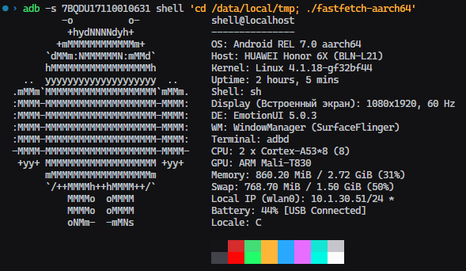
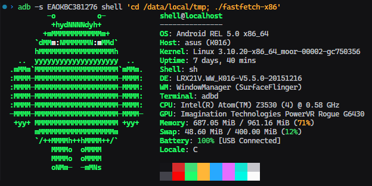

# fastfetch-android

Cross-compiles [fastfetch](https://github.com/fastfetch-cli/fastfetch) for Android using Docker and Android NDK r27c.





## Requirements

- Docker + Docker Compose
- `adb` in PATH (for device testing)

## Build

```bash
docker compose up --build
```

Produces `out/fastfetch-aarch64` and `out/fastfetch-x86`.

To build a single target:

```bash
BUILD_TARGETS=aarch64 docker compose up --build
BUILD_TARGETS=x86     docker compose up --build
```

To control parallelism:

```bash
JOBS=4 docker compose up --build
```

## Deploy and run

```bash
# push and run on a connected device
adb push out/fastfetch-aarch64 /data/local/tmp/fastfetch
adb shell "chmod +x /data/local/tmp/fastfetch && /data/local/tmp/fastfetch"

# pipe mode (no colors/logo, easier to parse)
adb shell /data/local/tmp/fastfetch --pipe
```

## Rebuilding after source changes

The build script and stubs are bind-mounted, so changes take effect without rebuilding the image:

```bash
docker compose run --rm fastfetch-android-build
```

To force a full image rebuild (e.g. after changing `Dockerfile` or bumping `FASTFETCH_REF`):

```bash
docker compose up --build
```

## Android compatibility patches

Bionic is missing several glibc headers and functions that fastfetch expects on Linux.
Stubs live in `src/android-stubs/` and are injected via `-I` at compile time.
All stubs are `static inline` — no runtime symbol dependencies.

| File | Why |
|------|-----|
| `glob.h` | Bionic has no `glob.h`; fastfetch falls back from `wordexp` to `glob` |
| `GL/gl.h` | Android auto-detects EGL, then includes desktop `GL/gl.h`; redirected to `GLES/gl.h` |
| `sys/sysinfo.h` | Forwards to real header; adds `get_nprocs`/`get_nprocs_conf` stubs for API < 23 |
| `ifaddrs.h` | `getifaddrs`/`freeifaddrs` added in API 24; stub returns `ENOSYS` for API < 24 |

`src/patch-dtflags.py` clears the `DF_1_PIE` bit from `DT_FLAGS_1` after linking.
NDK r27c's lld sets this bit; Android ≤ 7's linker doesn't recognise it and prints a harmless warning. The patch silences it.
